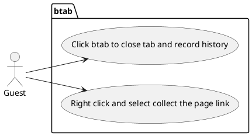

# btab

Just for chrome plugin development study.

## design

```plantuml
@startuml
left to right direction
actor Guest as g
package btab {
  usecase "Click btab to close tab and record history" as UC1
  usecase "Right click and select collect the page link" as UC2
}
g --> UC1
g --> UC2
@enduml
```
